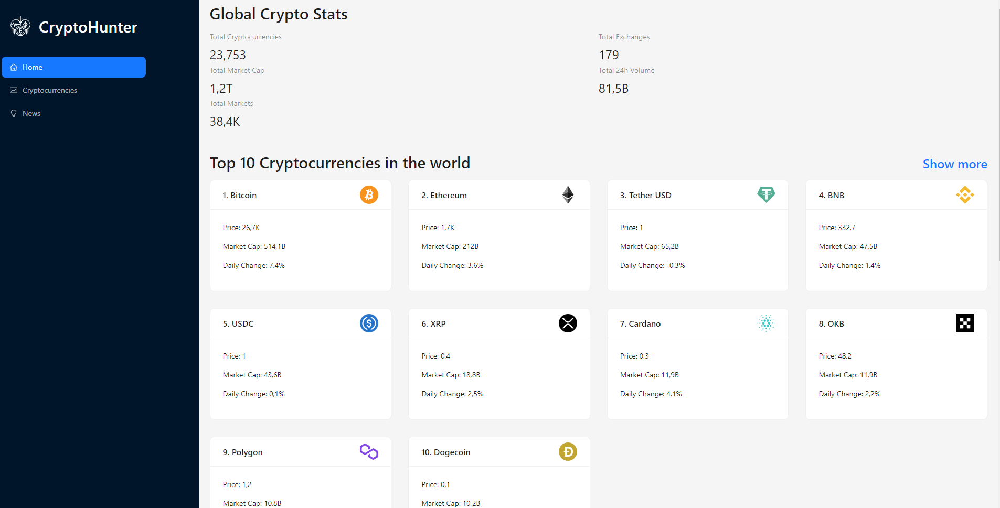
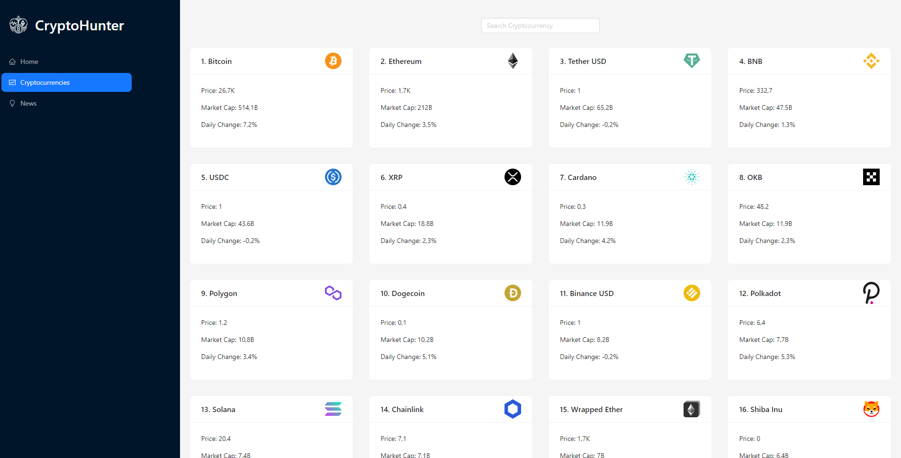
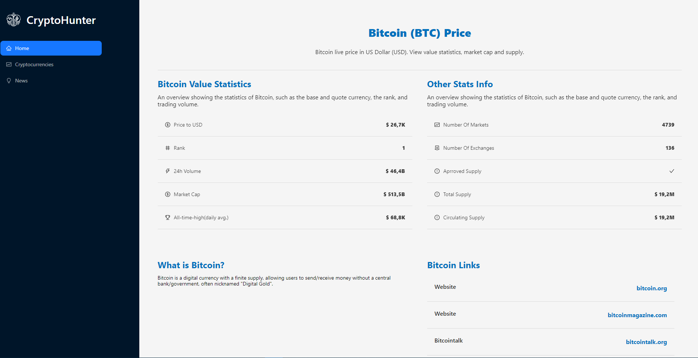
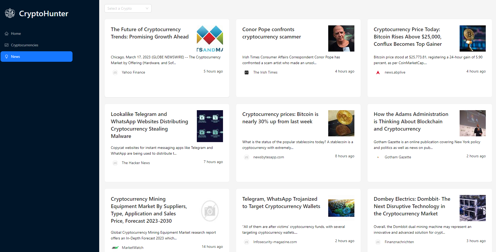

<h2>
  About :grey_question:
</h2>

CryptoHunter is a web application where users can get information about cryptocurrencies and read news about them.
Here is the live version: https://cryptohunter-eta.vercel.app

<h2>
  Flow :ocean:
</h2>

  When you start the app it welcomes you with the homepage and there you can see the top 10 cryptocurrencies and global stats about cryptocurrencies. Below homepage there are 6 news about them. In Cryptocurrencies page users can search other cryptocurrencies and have specific information about them if they click the card and there is a whole new page for news that includes news about Cryptocurrencies. Users can select whichever crypto they want at the dropdown menu and get the news about that specific crypto. 

<h2>Features 📱</h2>
<ul>
  <li>React</li>
  <li>Ant Design</li>
  <li>Hooks</li>
  <li>Redux Toolkit</li>
  <li>Router</li>
</ul>
<h2>
  Screenshots :camera_flash:
</h2>
<h3>Homepage</h3>

    

<h3>CryptoCurrencies</h3>

    

<h3>CryptoDetail</h3>

    

<h3>News</h3>

    

<h1> Installation </h1>

### How to run the example?

1. Clone this repo.
2. Open the downloaded folder with Visual Studio Code.
3. Run `npm install` on terminal.
4. Run `npm start` on terminal.
